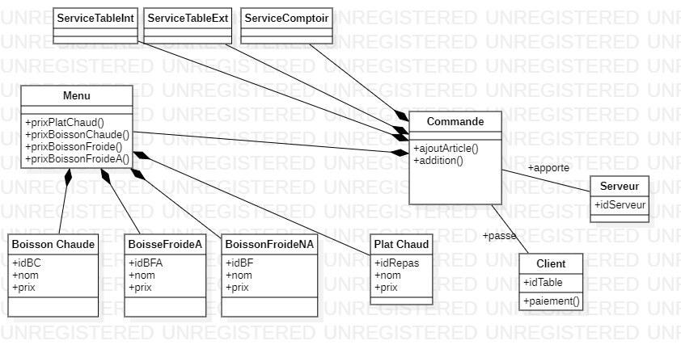
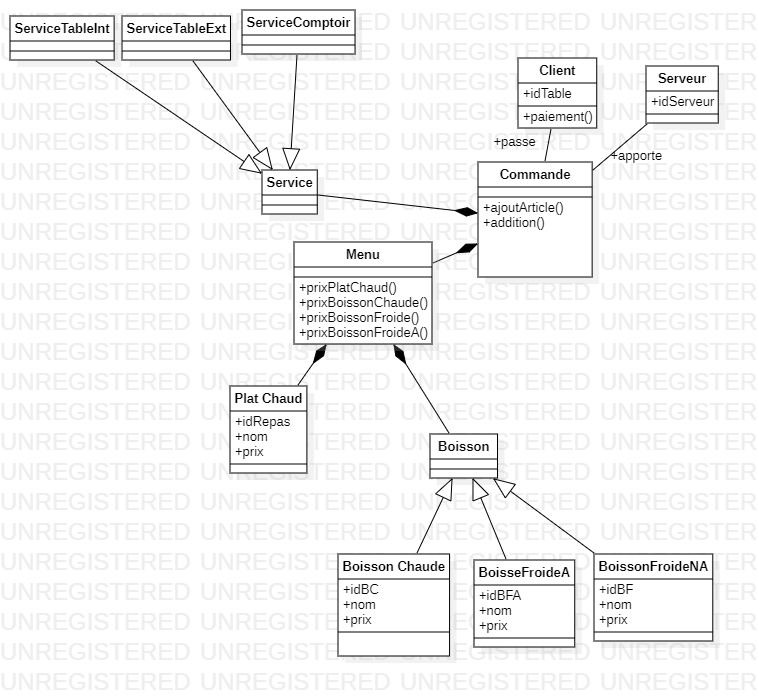
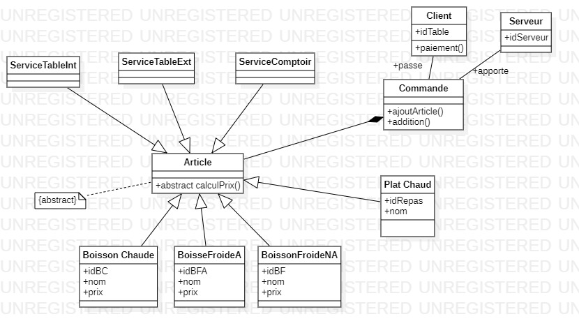
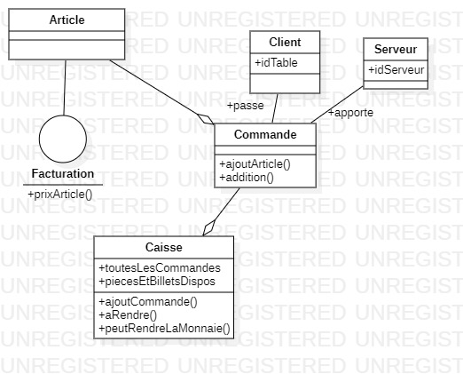

# Utilisation

java -jar app/build/libs/app-0.1.0.jar

[Code source](https://github.com/ljuglaret/nfa019td0/tree/main/app/src/main/java/tp0)

# Exercice 1

La carte du restaurant se trouve dans le fichier app/src/main/resources/Carte.json.
Il y a quatre groupes :
-   repasChaud
-   boissonChaude
-   boissonFroide (les boissons froides non alcoolisées)
-   boissonFroideA (les boissons froides alcoolisées)

Chaque version demandée contient une classe Main.
Les informations relatifs aux commandes sont à saisir dans cette classe.

## Diagramme de classe Classes et Objets

Les services "comptoir" , "table exterieure", "table interieure" sont représentés respectivement par les numéros 0, 1, 2.

 

## Diagramme de classe Héritage
C'est la reprise de la question précédente avec une classe parente "Service" et "Boisson".

## Diagramme de classe Abstraction
Il n'y a plus la classe Menu, le prix de chaque article est calculé directement dans la classe lui correspondant.

## Diagramme de classe Interface

## Diagramme de classe Exception

Pour déterminer si une caisse contient suffisamment de monnaie pour rendre au client, on calcule toutes
les sommes disponibles dans les caisses puis on vérifie si l'une d'elle correspond à la valeur voulue.

